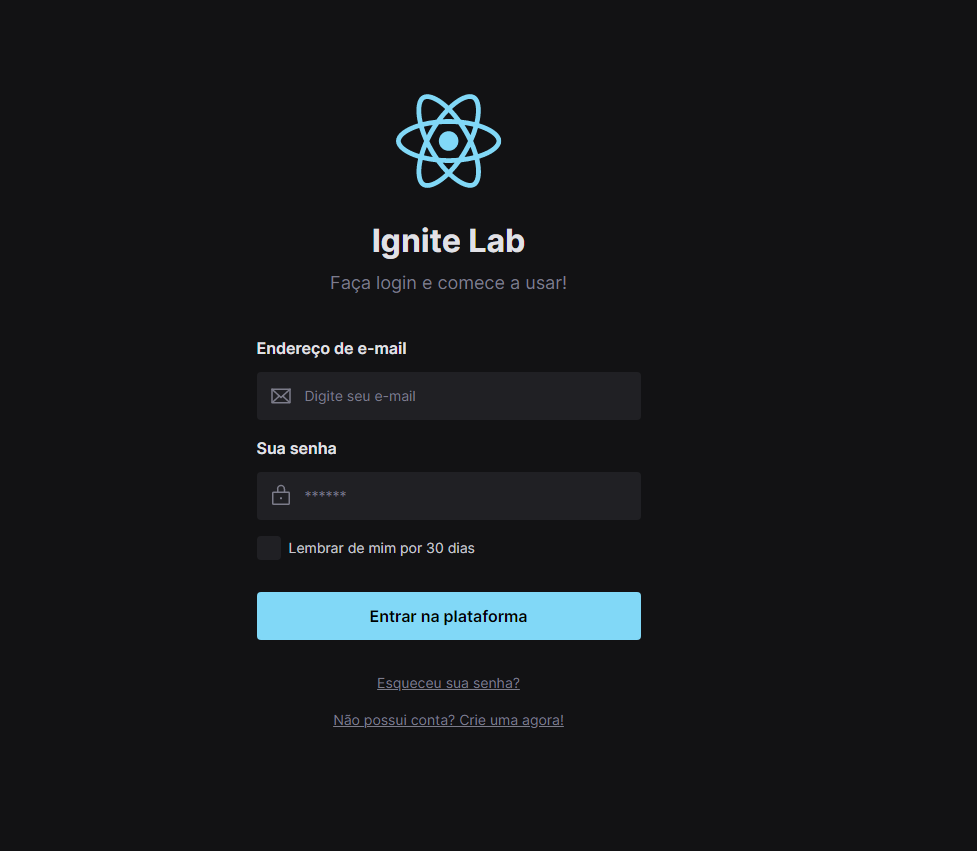

<h1 align="center"> Tela de Login React </h1>

  

## 🚀 Tecnologias

Esse projeto foi desenvolvido com as seguintes tecnologias:

- React
- TailWind
- StoryBook
- PostCss
- Node e NPM
- Vite

## 💻 Projeto

O projeto é um componente que simula o formulário de preenchimento de login, onde é possível adicionar máscara aos inputs e atualizar elementos HTML via DOM. 
Você pode vê-lo aqui (https://credit-card-forms.vercel.app)
